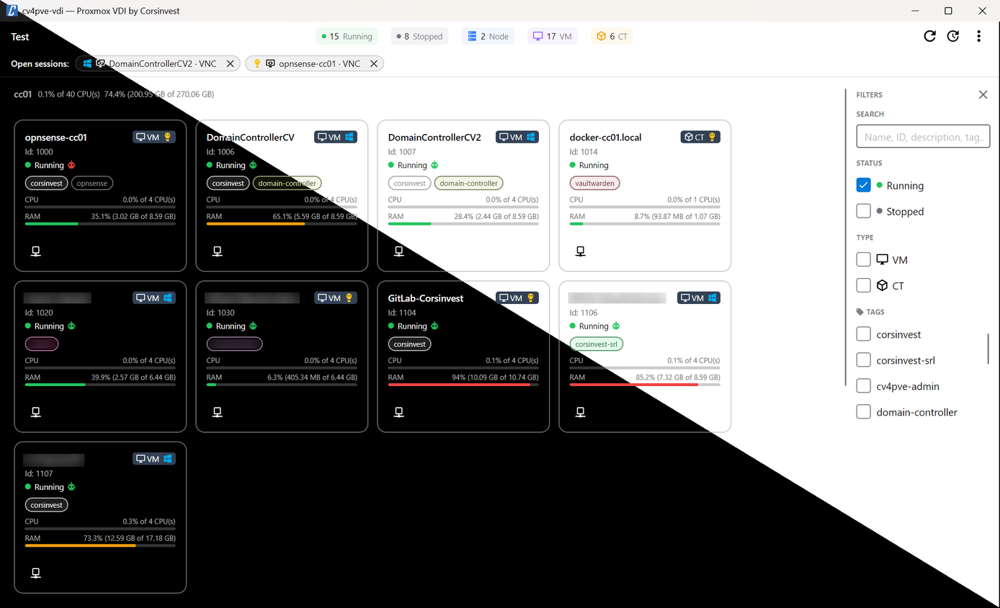

#  cv4pve-vdi

```
   ______                _                      __
  / ____/___  __________(_)___ _   _____  _____/ /_
 / /   / __ \/ ___/ ___/ / __ \ | / / _ \/ ___/ __/
/ /___/ /_/ / /  (__  ) / / / / |/ /  __(__  ) /_
\____/\____/_/  /____/_/_/ /_/|___/\___/____/\__/

VDI client for Proxmox VE (Made in Italy)
```

[](LICENSE.md)
[](https://github.com/Corsinvest/cv4pve-vdi/releases/latest)
[](https://github.com/Corsinvest/cv4pve-vdi/releases)
[](https://winstall.app/apps/Corsinvest.cv4pve.vdi)

> **Desktop VDI client for Proxmox VE** — log in with your Proxmox account and open your VMs and containers with SPICE, VNC, RDP or SSH, without the web UI.
>
> **[Documentation](https://corsinvest.github.io/cv4pve-vdi/)**



---

## Why

The Proxmox VE web interface is built for administrators. Someone who only needs to *use* a few VMs has to find them in the tree, download a `.vv` file for SPICE, or look up the IP address before opening RDP.

cv4pve-vdi lists the VMs and containers the user's own Proxmox account may use and opens each one with a click. It **runs on the user's computer and uses only the Proxmox VE API**: nothing to install on the nodes, and VNC is tunnelled through the API port.

---

## Features

- **SPICE and VNC** in `remote-viewer` — VNC over the API port, no console ports to open.
- **RDP, SSH and any tool** — services per VM, with the IP address read from the QEMU guest agent and port discovery.
- **RDP single sign-on on Windows** — the Proxmox login or the service's credentials passed to `mstsc` through the Windows Credential Manager.
- **Permissions from Proxmox VE** — each user sees only the guests their account allows; Start and Shutdown follow `VM.PowerMgmt`.
- **Kiosk mode** — full-screen, settings behind an admin password, Switch user for shared thin clients.
- **Open sessions** — every viewer started is listed; bring it to the front or close it.
- **Several clusters** to choose at login, card and list view, filters by status, type, node, pool and tag, ten languages.

---

## Quick start

```bash
# Windows
winget install Corsinvest.cv4pve.vdi
winget install RedHat.VirtViewer      # remote-viewer, for SPICE and VNC

# Linux (other platforms: see the documentation)
wget https://github.com/Corsinvest/cv4pve-vdi/releases/latest/download/cv4pve-vdi-linux-x64.zip
unzip cv4pve-vdi-linux-x64.zip && chmod +x cv4pve-vdi
sudo apt install virt-viewer          # remote-viewer, for SPICE and VNC
./cv4pve-vdi
```

Add your cluster from the gear in the login window, set the path of `remote-viewer` in **Settings → Launchers**, and log in with a Proxmox VE account (`user@realm`). The privileges it needs are in [Permissions](https://corsinvest.github.io/cv4pve-vdi/permissions/).

---

## Documentation

| | |
|---|---|
| [Getting started](https://corsinvest.github.io/cv4pve-vdi/getting-started/) | Install, remote-viewer, first cluster, login |
| [Permissions](https://corsinvest.github.io/cv4pve-vdi/permissions/) | Users and privileges |
| [How it connects](https://corsinvest.github.io/cv4pve-vdi/how-it-connects/) | Ports, SPICE proxy, the VNC bridge |
| [The main window](https://corsinvest.github.io/cv4pve-vdi/main-window/) | Which guests appear, filters, power, open sessions |
| [SPICE and VNC](https://corsinvest.github.io/cv4pve-vdi/consoles/) | The two consoles |
| [Services](https://corsinvest.github.io/cv4pve-vdi/services/) and [Launchers](https://corsinvest.github.io/cv4pve-vdi/launchers/) | RDP, SSH and custom tools, credentials, RDP single sign-on |
| [Kiosk mode](https://corsinvest.github.io/cv4pve-vdi/kiosk/) | Thin clients and shared workstations |
| [Settings](https://corsinvest.github.io/cv4pve-vdi/settings/) | Every setting and the configuration files |
| [Troubleshooting](https://corsinvest.github.io/cv4pve-vdi/troubleshooting/) | Missing VMs, consoles and services that do not open |

---

## Related tools

Prefer the command line? [cv4pve-pepper](https://github.com/Corsinvest/cv4pve-pepper) opens a SPICE or VNC console with one command. The whole suite: [corsinvest.it/cv4pve](https://www.corsinvest.it/en/cv4pve/).

---

## Support

Professional support and consulting available through [Corsinvest](https://www.corsinvest.it/en/cv4pve/).

---

Part of [cv4pve](https://www.corsinvest.it/cv4pve) suite | Made with ❤️ in Italy by [Corsinvest](https://www.corsinvest.it)

Copyright © Corsinvest Srl
