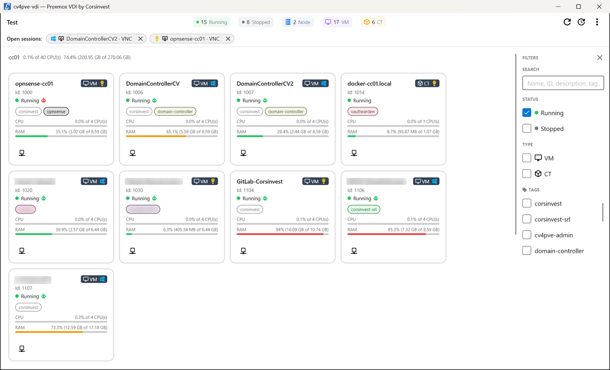
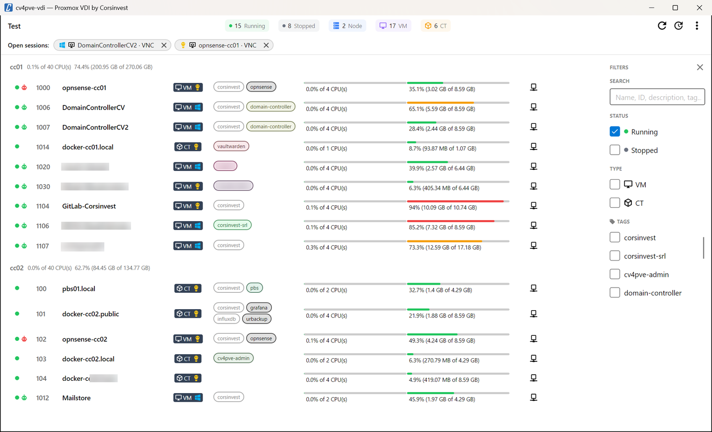

import { Tabs, TabItem } from '@astrojs/starlight/components';
import vmServicesMenu from '../../assets/vm-services-menu.png';
import openSessions from '../../assets/open-sessions.png';

After login the main window lists the VMs and containers of the cluster that the account may use, grouped
by node. Each guest has a **Connect** button with its consoles and services.

<Tabs>
  <TabItem label="Card view">
    
  </TabItem>
  <TabItem label="List view">
    
  </TabItem>
</Tabs>

## Top bar

- **Cluster name**, on the left.
- **Counters**: running and stopped guests, nodes, VMs, containers — of everything the account can see,
  whatever the filters.
- **Refresh** (`F5`) reloads the list from the cluster.
- **Auto-refresh** refreshes every 30 seconds while on (a `30s` label shows it). It is off at start and
  turns on by itself after a Start or Shutdown click, so the new state shows up.
- **⋮ More**: the version, a new release when there is one (with a red dot on the button), **Settings**
  (`Ctrl+,`), **Switch user**, and links to documentation, release notes, support, bug reports and feature
  requests.

## Cards and list

The view — cards or a compact list — is chosen in [Settings → Appearance](/cv4pve-vdi/settings/#appearance),
together with grouping by node and sorting by ID or name. Each guest shows:

| Element | What it tells you |
|---|---|
| Name and **VM** / **CT** badge | Type of guest; for VMs the Windows or Linux logo follows the OS type set in Proxmox VE, containers show Linux |
| **Id** | VMID, followed by the pool when **Show pools** is on |
| Status dot | Green running, grey stopped (Running, Stopped or Paused in the card) |
| Agent icon | Only for VMs with the QEMU guest agent enabled in their options: grey until **Ping guest agent** is on, then green when the agent answers, red when it does not — see [Guest setup](/cv4pve-vdi/guest-setup/) |
| SPICE badges | Audio: the VM has an audio device with the SPICE driver. USB: a USB port is redirected to SPICE |
| Tags | Proxmox VE tags, in the colours of the datacenter tag style; a tag without a colour there gets one computed from its name |
| CPU and RAM bars | Current usage; the bar turns amber above 60% and red above 80% |
| Buttons | Start, Shutdown and Connect |

Node headers show the node's CPU and memory use when the account has `Sys.Audit` on the node.

## Which guests appear

cv4pve-vdi shows a guest only when there is something the account can do with it:

| Guest | Shown when |
|---|---|
| Running VM | The account has `VM.Console` on it, or the VM has a SPICE display and SPICE is on in Settings → Launchers |
| Running container | The account has `VM.Console` on it |
| Stopped VM | The account has `VM.PowerMgmt` on it (so it can be started), or its display is SPICE (`qxl…` or `spice`) and SPICE is on in Settings → Launchers |
| Stopped container | The account has `VM.PowerMgmt` on it |

Guests the account cannot audit are never returned by Proxmox VE. The **Status** filter starts with
**Running** ticked: tick **Stopped** too, or reset the filters, to see stopped guests.

## Filters

The panel on the right filters the list; within a section, ticking nothing means no filter.

- **Search** (`Ctrl+F`): name, VMID, description or tag.
- **Status**: running, stopped.
- **Type**: VM, CT.
- **Node**, **Pool**, **Tags**: shown when turned on in Settings → Appearance. Pools and tags list only
  those of the guests cv4pve-vdi shows.
- **×** next to *Filters* clears every filter, **Running** included.

When the filters hide everything, the window says so instead of staying blank.

## Start and Shutdown

With **Show Start button** and **Show Shutdown button** on in Settings → Appearance, guests the account may
power (`VM.PowerMgmt`) get a green Start button when stopped and a red Shutdown button when running.
Shutdown asks the guest to shut down, as the power button would; it does not stop it. **Ask confirmation**
adds a question before each click.

## Connect

The **Connect** button opens a menu with, in this order:

1. **SPICE** and **VNC**, when available — see [SPICE and VNC](/cv4pve-vdi/consoles/);
2. the [services](/cv4pve-vdi/services/) configured for the guest, for the launchers of this operating system;
3. **Services…**, to configure them (admin password in [kiosk mode](/cv4pve-vdi/kiosk/)).

## Open sessions

Every viewer or launcher started from cv4pve-vdi appears in a strip at the top of the window, with the
guest's OS, the protocol and the guest name. The strip hides itself when nothing is open.

- **Click** a session to bring its window to the front — useful in [kiosk mode](/cv4pve-vdi/kiosk/), where
  there may be no taskbar.
- **×** closes it: cv4pve-vdi asks the window to close and ends the process if it is still running after
  one second.

Closing cv4pve-vdi or using **Switch user** with sessions open asks for confirmation, then closes them, so
the next person does not find the previous user's sessions.

A session stays in the strip as long as the process cv4pve-vdi started is running. Launchers that hand
the window over to another process and exit — `osascript` for the macOS Terminal, for example — do not stay
in the strip.

Bringing a window to the front uses what each system offers: on Linux it needs `xdotool` and an X11
session (Wayland does not allow it); on macOS the system asks once for the Accessibility permission.

## Switch user

**⋮ → Switch user** goes back to the login window without closing the application, for shared
workstations and thin clients. Open sessions are closed after confirmation, and in kiosk mode the admin
unlock is cleared.

## Keyboard shortcuts

| Keys | Action |
|---|---|
| `Ctrl+F` | Search |
| `F5` | Refresh |
| `Ctrl+,` | Settings |

